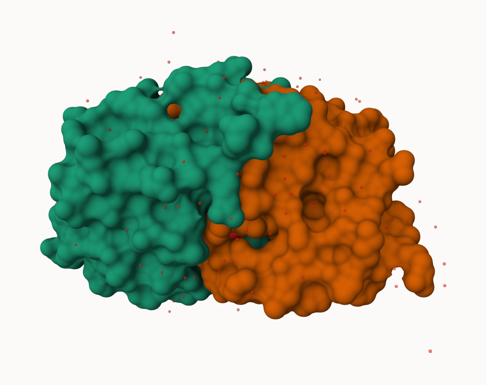
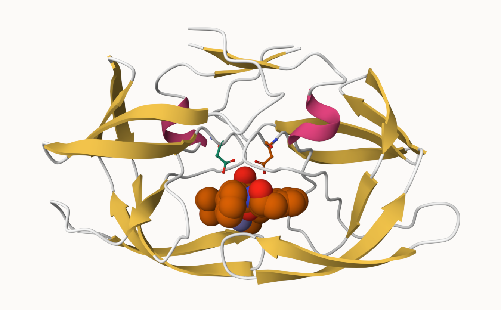
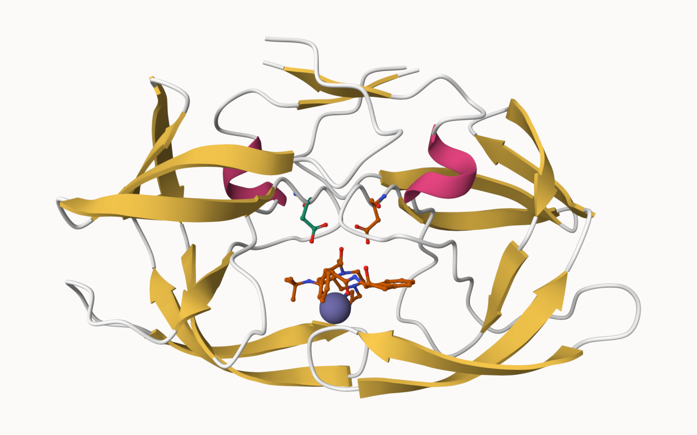

## The PDB database

The [Protein Data Bank (PDB)](https:///www.rcsb.org/) is the main repository of biomolecular strucuture data. Let'ssee what is in it: 


```{r}
stats <- read.csv("pdb_stats.csv", row.names = 1)
stats
```


>Q1: What percentage of structures in the PDB are solved by X-Ray and Electron Microscopy.

```{r}
n.sums <- colSums(stats)
n <- n.sums/n.sums["Total"]
round(n, digits = 2)

```


>Q2: What proportion of structures in the PDB are protein?


```{r}
n.sums["Total"]
```

```{r}
total_all <- sum(stats)
total_protein <- sum(stats["Protein (only)", ])
prop_protein <- total_protein / total_all
round(prop_protein * 100, 1)
```

87% of PDB structures are protein. 

>Q3: Type HIV in the PDB website search box on the home page and determine how many HIV-1 protease structures are in the current PDB?

There are 1,173 HIV-1 protease structures in the PDB database. 

## Using Molsar

We can use the main [Molstar viewer online](https://molstar.org/viewer/)



> Q. Generate and insert an image of the HIV-Pr cartoon colored by secondary strucure, showing the inhibitor (ligand) in ball and stick.




> Generate an insert an image of the HIV-Pr cartoon of the water molecule 


>Q4: Water molecules normally have 3 atoms. Why do we see just one atom per water molecule in this structure?

We only see one atom per water molecule in this structure because the hydrogens of water are not resolved, meaning the PDB is only showing the oxygen atom. 


>Q5: There is a critical “conserved” water molecule in the binding site. Can you identify this water molecule? What residue number does this water molecule have

HOH 308, chain A


>Q6: Generate and save a figure clearly showing the two distinct chains of HIV-protease along with the ligand. You might also consider showing the catalytic residues ASP 25 in each chain and the critical water (we recommend “Ball & Stick” for these side-chains). Add this figure to your Quarto document.


## The Bio3D package for structural bioinformatics 

```{r}
library(bio3d)

hiv <- read.pdb("1hsg")
hiv

```
>Q7: How many amino acid residues are there in this pdb object? 

There are 198 amino acid residues in this pdb object. 


>Q8: Name one of the two non-protein residues? 

One of the two non-protein residues is MK1. 

>Q9: How many protein chains are in this structure? 

There are two protein chains in this structure. 

```{r}
attributes(hiv)
```


```{r}
head(hiv$atom) 
```

```{r}
pdbseq(hiv)
```

Let's try out the new **bio3dview** package that is not yet on CRAN. 
We can use the **remotes** package to install any R package from GitHub. 


```{r}
library(bio3dview)
library(NGLVieweR)

#view.pdb(hiv) |>
  #setSpin()
```

>Q10. Which of the packages above is found only on BioConductor and not CRAN? 

msa

>Q11. Which of the above packages is not found on BioConductor or CRAN?: 

bio3dview

>Q12. True or False? Functions from the pak package can be used to install packages from GitHub and BitBucket? 

True

>Q13. How many amino acids are in this sequence, i.e. how long is this sequence? 

This sequence has a length of 214 amino acids. 

### Quick viewing of PDBs
```{r}
library(bio3dview)

sele <- atom.select(hiv, resno=25)

#view.pdb(hiv, cols=c("navy","teal"), 
         #highlight = sele,
         #highlight.style = "spacefill") |>
  #setRock()
```

### Prediction of Protein flexibility 

```{r}
adk <- read.pdb("6s36")
m <- nma(adk)
plot(m)
```
>Q14. What do you note about this plot? Are the black and colored lines similar or different? Where do you think they differ most and why?

The colored lines seem mostly similar but seem to change in the flexible parts of the protein. They most likely move the most during the open and closing conformational change. 

Write out our results as a wee trajectory movie:

```{r}
mktrj(m, file="results.pdb")
```

## Comparitive protein structure analysis with PCA

We start with a database id "1ake_A"

```{r}
library(bio3d)

id <- "1ake_A"
aa <- get.seq(id)
```

```{r}
blast <- blast.pdb(aa)
```


```{r}
head(blast$hit.tbl)
```


```{r}
hits <- plot(blast)
```

Peak at our "top hits"

```{r}
head(hits$pdb.id)
```

Now we can download these "top hits". These will all be ADK structures in the PDB database. 

```{r}
files <- get.pdb(hits$pdb.id, path = "pdbs", split = TRUE, gzip = TRUE)
```

We need one package from BioConductor. to set this up we need to first install a package called **"BiocManager"** from CRAN. 

Now we can use the `install()` function from this package like this:

`BiocManager::install("msa)` 

```{r}
pdbs <- pdbaln(files, fit = TRUE, exefile="msa")
```

Let's have a peak at our structures after "fitting" or superposing: 

```{r}
library(bio3dview)
view.pdbs(pdbs)
```

```{r}
view.pdbs(pdbs, colorScheme= "residue")
```

We can run functions like `rmdsd()`, `rmsf()` and the best `pca()`

```{r}
pc.xray <- pca(pdbs)
plot(pc.xray)
```
```{r}
plot(pc.xray, 1:2)
```

Finally, let's make a movie of the major "motion" or structure difference in the dataset - we call this a "trajectory". 

```{r}
mktrj(pc.xray, file = "results.pdb")
```

