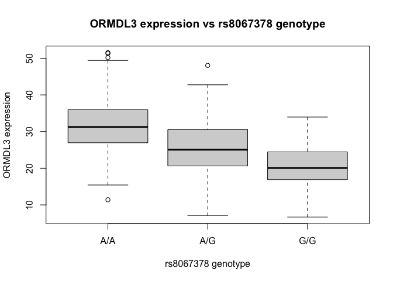

# Class 12: Genome Informatics Lab Q13&Q14
Cyrus Shabahang (PID:19145663)

> Q13 - Read this file into R and determine the sample size for each
> genotype and their corresponding median expression levels for each of
> these genotypes.

``` r
url_w19 <- "https://bioboot.github.io/bggn213_W19/class-material/rs8067378_ENSG00000172057.6.txt"
dat <- read.table(url_w19, header=TRUE, stringsAsFactors=FALSE)
head(dat)
```

       sample geno      exp
    1 HG00367  A/G 28.96038
    2 NA20768  A/G 20.24449
    3 HG00361  A/A 31.32628
    4 HG00135  A/A 34.11169
    5 NA18870  G/G 18.25141
    6 NA11993  A/A 32.89721

``` r
str(dat)
```

    'data.frame':   462 obs. of  3 variables:
     $ sample: chr  "HG00367" "NA20768" "HG00361" "HG00135" ...
     $ geno  : chr  "A/G" "A/G" "A/A" "A/A" ...
     $ exp   : num  29 20.2 31.3 34.1 18.3 ...

``` r
colnames(dat)
```

    [1] "sample" "geno"   "exp"   

``` r
n_by_geno <- table(dat$geno)
n_by_geno
```


    A/A A/G G/G 
    108 233 121 

``` r
med_by_geno <- tapply(dat$exp, dat$geno, median)
med_by_geno
```

         A/A      A/G      G/G 
    31.24847 25.06486 20.07363 

``` r
summary_tbl <- data.frame(
  genotype = names(n_by_geno),
  n = as.vector(n_by_geno), 
  median_exp = as.vector(med_by_geno)
  
)
summary_tbl
```

      genotype   n median_exp
    1      A/A 108   31.24847
    2      A/G 233   25.06486
    3      G/G 121   20.07363

The sample sizes are: A/A: 108, A/G: 233, and G/G: 121. The median
expression values are 31.24847 (A/A), 25.06486 (A/G), and 20.07363
(G/G).

> Q14 - Generate a boxplot with a box per genotype, what could you infer
> from the relative expression value between A/A and G/G displayed in
> this plot? Does the SNP effect the expression of ORMDL3?

``` r
boxplot(exp ~ geno, data=dat,
        xlab = "rs8067378 genotype", 
        ylab = "ORMDL3 expression",
        main = "ORMDL3 expression vs rs8067378 genotype")
```



When the A/A box has a higher median than G/G, the A allele has a
corresponding higher ORMDL3 expression. A/A has the highest expression,
A/G is intermediate, and G/G has the lowest expression. If the G/G box
has a higher median than A/A, then the G allele has a higher ORMDL3
expression. The SNP does affect the expression of ORMDL3.
