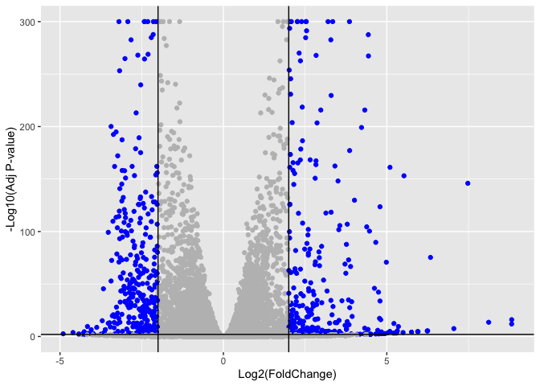
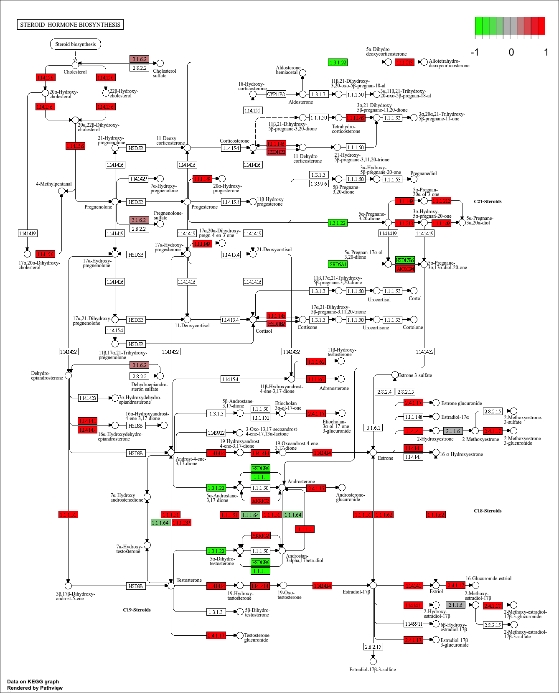
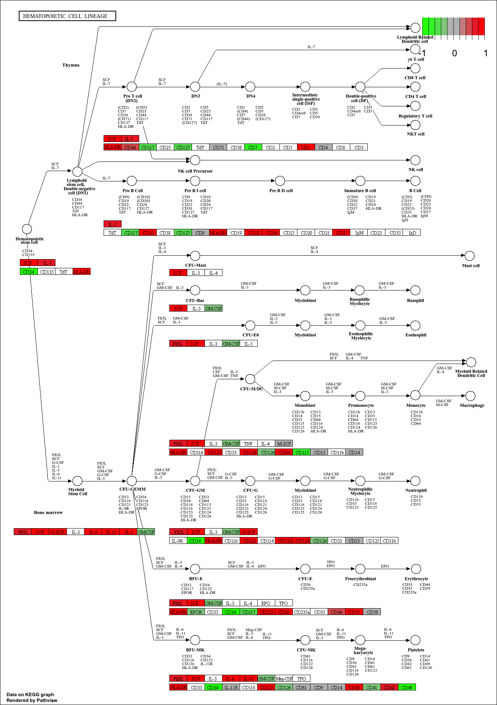
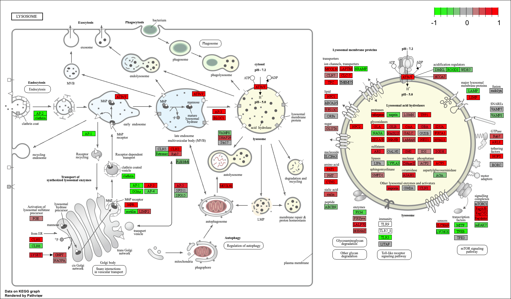
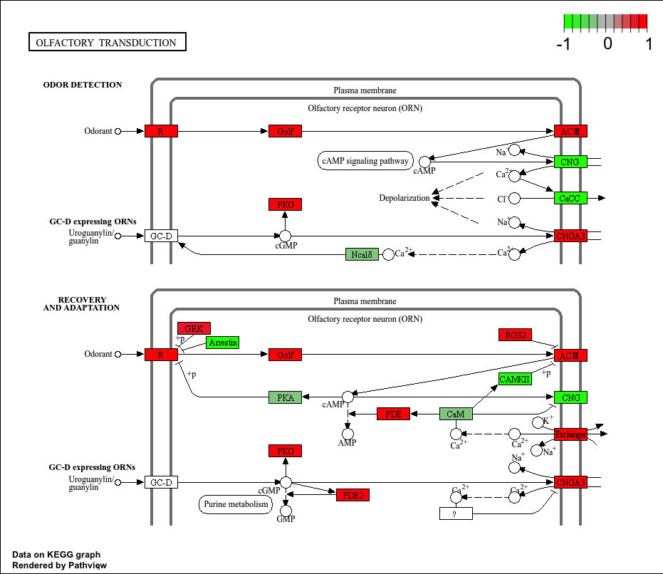

# Class 14: RNA-Seq Mini-Project
Cyrus Shabahang (PID:19145663)

- [Background](#background)
- [Data Import](#data-import)
  - [Clean up (data tidying)](#clean-up-data-tidying)
- [DESeq Analysis](#deseq-analysis)
  - [Setting up the required DESeq
    object](#setting-up-the-required-deseq-object)
  - [Running DESeq](#running-deseq)
  - [Getting results](#getting-results)
- [Volcano Plot](#volcano-plot)
- [Add Annotation](#add-annotation)
- [Pathway Analysis](#pathway-analysis)
  - [KEGG](#kegg)
  - [Reactome](#reactome)

## Background

The data for today’s mini-project comes from a knock-down study of an
important HOX gene.

## Data Import

``` r
library(DESeq2)
```

``` r
colData <- "GSE37704_metadata.csv"
countData <- "GSE37704_featurecounts.csv"
colData = read.csv(colData, row.names = 1)
countData = read.csv(countData, row.names = 1)
```

``` r
head(colData)
```

                  condition
    SRR493366 control_sirna
    SRR493367 control_sirna
    SRR493368 control_sirna
    SRR493369      hoxa1_kd
    SRR493370      hoxa1_kd
    SRR493371      hoxa1_kd

``` r
head(countData)
```

                    length SRR493366 SRR493367 SRR493368 SRR493369 SRR493370
    ENSG00000186092    918         0         0         0         0         0
    ENSG00000279928    718         0         0         0         0         0
    ENSG00000279457   1982        23        28        29        29        28
    ENSG00000278566    939         0         0         0         0         0
    ENSG00000273547    939         0         0         0         0         0
    ENSG00000187634   3214       124       123       205       207       212
                    SRR493371
    ENSG00000186092         0
    ENSG00000279928         0
    ENSG00000279457        46
    ENSG00000278566         0
    ENSG00000273547         0
    ENSG00000187634       258

### Clean up (data tidying)

We need to remove that odd first column in countData namely
countData\$length.

``` r
countData$length <- NULL 
head(countData)
```

                    SRR493366 SRR493367 SRR493368 SRR493369 SRR493370 SRR493371
    ENSG00000186092         0         0         0         0         0         0
    ENSG00000279928         0         0         0         0         0         0
    ENSG00000279457        23        28        29        29        28        46
    ENSG00000278566         0         0         0         0         0         0
    ENSG00000273547         0         0         0         0         0         0
    ENSG00000187634       124       123       205       207       212       258

This looks better but there are lots of zero entries in there so let’s
get rid of them as we have no data for these.

``` r
countData <- countData[rowSums(countData) > 0, ]
```

## DESeq Analysis

### Setting up the required DESeq object

``` r
countData <- as.matrix(countData)

all(colnames(countData) == rownames(colData))
```

    [1] TRUE

``` r
colData <- colData[colnames(countData), , drop = FALSE]
all(colnames(countData) == rownames(colData))
```

    [1] TRUE

### Running DESeq

``` r
dds <- DESeqDataSetFromMatrix(
  countData = countData, 
  colData = colData,
  design = ~ condition 
)
```

    Warning in DESeqDataSet(se, design = design, ignoreRank): some variables in
    design formula are characters, converting to factors

``` r
dds$condition <- relevel(dds$condition, "control_sirna")

dds <- DESeq(dds)
```

    estimating size factors

    estimating dispersions

    gene-wise dispersion estimates

    mean-dispersion relationship

    final dispersion estimates

    fitting model and testing

### Getting results

``` r
res <- results(dds)
summary(res)
```


    out of 15975 with nonzero total read count
    adjusted p-value < 0.1
    LFC > 0 (up)       : 4349, 27%
    LFC < 0 (down)     : 4396, 28%
    outliers [1]       : 0, 0%
    low counts [2]     : 1237, 7.7%
    (mean count < 0)
    [1] see 'cooksCutoff' argument of ?results
    [2] see 'independentFiltering' argument of ?results

``` r
res[order(res$padj), ][1:10, ]
```

    log2 fold change (MLE): condition hoxa1 kd vs control sirna 
    Wald test p-value: condition hoxa1 kd vs control sirna 
    DataFrame with 10 rows and 6 columns
                     baseMean log2FoldChange     lfcSE      stat    pvalue
                    <numeric>      <numeric> <numeric> <numeric> <numeric>
    ENSG00000117519   4483.63       -2.42272 0.0600016  -40.3776         0
    ENSG00000183508   2053.88        3.20196 0.0724172   44.2154         0
    ENSG00000159176   5692.46       -2.31374 0.0575534  -40.2016         0
    ENSG00000116016   4423.95       -1.88802 0.0431680  -43.7366         0
    ENSG00000164251   2348.77        3.34451 0.0690718   48.4208         0
    ENSG00000124766   2576.65        2.39229 0.0617086   38.7675         0
    ENSG00000124762  28106.12        1.83226 0.0388966   47.1058         0
    ENSG00000106366  43719.13       -1.84405 0.0419165  -43.9933         0
    ENSG00000188153   2944.13        2.26608 0.0552681   41.0016         0
    ENSG00000122861  28007.14        2.26253 0.0552183   40.9742         0
                         padj
                    <numeric>
    ENSG00000117519         0
    ENSG00000183508         0
    ENSG00000159176         0
    ENSG00000116016         0
    ENSG00000164251         0
    ENSG00000124766         0
    ENSG00000124762         0
    ENSG00000106366         0
    ENSG00000188153         0
    ENSG00000122861         0

## Volcano Plot

``` r
library(ggplot2)

res_df <- as.data.frame(res)
res_df$padj[is.na(res_df$padj)] <- 1
res_df$padj_plot <- pmax(res_df$padj, 1e-300)

mycols <- rep("gray", nrow(res_df))
mycols[abs(res_df$log2FoldChange) > 2] <- "blue"
mycols[res_df$padj > 0.01] <- "gray"

ggplot(res_df) +
  aes(x = log2FoldChange, y = -log10(padj_plot)) +
  geom_point(col = mycols) +
  xlab("Log2(FoldChange)") +
  ylab("-Log10(Adj P-value)") +
  geom_vline(xintercept = c(-2, 2)) +
  geom_hline(yintercept = -log10(0.01))
```



## Add Annotation

``` r
library("AnnotationDbi")
library("org.Hs.eg.db")
```

``` r
columns(org.Hs.eg.db)
```

     [1] "ACCNUM"       "ALIAS"        "ENSEMBL"      "ENSEMBLPROT"  "ENSEMBLTRANS"
     [6] "ENTREZID"     "ENZYME"       "EVIDENCE"     "EVIDENCEALL"  "GENENAME"    
    [11] "GENETYPE"     "GO"           "GOALL"        "IPI"          "MAP"         
    [16] "OMIM"         "ONTOLOGY"     "ONTOLOGYALL"  "PATH"         "PFAM"        
    [21] "PMID"         "PROSITE"      "REFSEQ"       "SYMBOL"       "UCSCKG"      
    [26] "UNIPROT"     

``` r
res$symbol = mapIds(org.Hs.eg.db,
                    keys = rownames(res),
                    keytype = "ENSEMBL",
                    column = "SYMBOL",
                    multiVals = "first")
```

    'select()' returned 1:many mapping between keys and columns

``` r
res$entrez = mapIds(org.Hs.eg.db, 
                  keys = row.names(res),
                  keytype = "ENSEMBL",
                  column = "ENTREZID", 
                  multiVals = "first")
```

    'select()' returned 1:many mapping between keys and columns

``` r
res$name = mapIds(org.Hs.eg.db,
                  keys = row.names(res),
                  keytype = "ENSEMBL",
                  column = "GENENAME",
                  multiVals = "first")
```

    'select()' returned 1:many mapping between keys and columns

``` r
head(res, 10)
```

    log2 fold change (MLE): condition hoxa1 kd vs control sirna 
    Wald test p-value: condition hoxa1 kd vs control sirna 
    DataFrame with 10 rows and 9 columns
                       baseMean log2FoldChange     lfcSE       stat      pvalue
                      <numeric>      <numeric> <numeric>  <numeric>   <numeric>
    ENSG00000279457   29.913579      0.1792571 0.3248216   0.551863 5.81042e-01
    ENSG00000187634  183.229650      0.4264571 0.1402658   3.040350 2.36304e-03
    ENSG00000188976 1651.188076     -0.6927205 0.0548465 -12.630158 1.43990e-36
    ENSG00000187961  209.637938      0.7297556 0.1318599   5.534326 3.12428e-08
    ENSG00000187583   47.255123      0.0405765 0.2718928   0.149237 8.81366e-01
    ENSG00000187642   11.979750      0.5428105 0.5215598   1.040744 2.97994e-01
    ENSG00000188290  108.922128      2.0570638 0.1969053  10.446970 1.51282e-25
    ENSG00000187608  350.716868      0.2573837 0.1027266   2.505522 1.22271e-02
    ENSG00000188157 9128.439422      0.3899088 0.0467163   8.346304 7.04321e-17
    ENSG00000237330    0.158192      0.7859552 4.0804729   0.192614 8.47261e-01
                           padj      symbol      entrez                   name
                      <numeric> <character> <character>            <character>
    ENSG00000279457 6.86555e-01          NA          NA                     NA
    ENSG00000187634 5.15718e-03      SAMD11      148398 sterile alpha motif ..
    ENSG00000188976 1.76549e-35       NOC2L       26155 NOC2 like nucleolar ..
    ENSG00000187961 1.13413e-07      KLHL17      339451 kelch like family me..
    ENSG00000187583 9.19031e-01     PLEKHN1       84069 pleckstrin homology ..
    ENSG00000187642 4.03379e-01       PERM1       84808 PPARGC1 and ESRR ind..
    ENSG00000188290 1.30538e-24        HES4       57801 hes family bHLH tran..
    ENSG00000187608 2.37452e-02       ISG15        9636 ISG15 ubiquitin like..
    ENSG00000188157 4.21963e-16        AGRN      375790                  agrin
    ENSG00000237330          NA      RNF223      401934 ring finger protein ..

Let’s reorder these results by adjusted p-value and save them to a CSV
file in our current project directory.

``` r
res <- res[!is.na(res$padj), ]
res <- res[order(res$padj), ]
write.csv(as.data.frame(res), file = "deseq_results.csv")
```

## Pathway Analysis

Let’s load the packages and setup the KEGG data-sets we need:

``` r
library(pathview)
```

    ##############################################################################
    Pathview is an open source software package distributed under GNU General
    Public License version 3 (GPLv3). Details of GPLv3 is available at
    http://www.gnu.org/licenses/gpl-3.0.html. Particullary, users are required to
    formally cite the original Pathview paper (not just mention it) in publications
    or products. For details, do citation("pathview") within R.

    The pathview downloads and uses KEGG data. Non-academic uses may require a KEGG
    license agreement (details at http://www.kegg.jp/kegg/legal.html).
    ##############################################################################

``` r
library(gage)
```

``` r
library(gageData)

data(kegg.sets.hs)
data(sigmet.idx.hs)

kegg.sets.hs = kegg.sets.hs[sigmet.idx.hs]

head(kegg.sets.hs, 3)
```

    $`hsa00232 Caffeine metabolism`
    [1] "10"   "1544" "1548" "1549" "1553" "7498" "9"   

    $`hsa00983 Drug metabolism - other enzymes`
     [1] "10"     "1066"   "10720"  "10941"  "151531" "1548"   "1549"   "1551"  
     [9] "1553"   "1576"   "1577"   "1806"   "1807"   "1890"   "221223" "2990"  
    [17] "3251"   "3614"   "3615"   "3704"   "51733"  "54490"  "54575"  "54576" 
    [25] "54577"  "54578"  "54579"  "54600"  "54657"  "54658"  "54659"  "54963" 
    [33] "574537" "64816"  "7083"   "7084"   "7172"   "7363"   "7364"   "7365"  
    [41] "7366"   "7367"   "7371"   "7372"   "7378"   "7498"   "79799"  "83549" 
    [49] "8824"   "8833"   "9"      "978"   

    $`hsa00230 Purine metabolism`
      [1] "100"    "10201"  "10606"  "10621"  "10622"  "10623"  "107"    "10714" 
      [9] "108"    "10846"  "109"    "111"    "11128"  "11164"  "112"    "113"   
     [17] "114"    "115"    "122481" "122622" "124583" "132"    "158"    "159"   
     [25] "1633"   "171568" "1716"   "196883" "203"    "204"    "205"    "221823"
     [33] "2272"   "22978"  "23649"  "246721" "25885"  "2618"   "26289"  "270"   
     [41] "271"    "27115"  "272"    "2766"   "2977"   "2982"   "2983"   "2984"  
     [49] "2986"   "2987"   "29922"  "3000"   "30833"  "30834"  "318"    "3251"  
     [57] "353"    "3614"   "3615"   "3704"   "377841" "471"    "4830"   "4831"  
     [65] "4832"   "4833"   "4860"   "4881"   "4882"   "4907"   "50484"  "50940" 
     [73] "51082"  "51251"  "51292"  "5136"   "5137"   "5138"   "5139"   "5140"  
     [81] "5141"   "5142"   "5143"   "5144"   "5145"   "5146"   "5147"   "5148"  
     [89] "5149"   "5150"   "5151"   "5152"   "5153"   "5158"   "5167"   "5169"  
     [97] "51728"  "5198"   "5236"   "5313"   "5315"   "53343"  "54107"  "5422"  
    [105] "5424"   "5425"   "5426"   "5427"   "5430"   "5431"   "5432"   "5433"  
    [113] "5434"   "5435"   "5436"   "5437"   "5438"   "5439"   "5440"   "5441"  
    [121] "5471"   "548644" "55276"  "5557"   "5558"   "55703"  "55811"  "55821" 
    [129] "5631"   "5634"   "56655"  "56953"  "56985"  "57804"  "58497"  "6240"  
    [137] "6241"   "64425"  "646625" "654364" "661"    "7498"   "8382"   "84172" 
    [145] "84265"  "84284"  "84618"  "8622"   "8654"   "87178"  "8833"   "9060"  
    [153] "9061"   "93034"  "953"    "9533"   "954"    "955"    "956"    "957"   
    [161] "9583"   "9615"  

``` r
foldchanges <- res$log2FoldChange
names(foldchanges) <- res$entrez

foldchanges <- foldchanges[!is.na(names(foldchanges))]
foldchanges <- foldchanges[!is.na(foldchanges)]

head(foldchanges)
```

         1266     54855      1465      2034      2150      6659 
    -2.422719  3.201955 -2.313738 -1.888019  3.344508  2.392288 

Let’s run KEGG pathway enrichment with gage

``` r
keggres <- gage(foldchanges, gsets = kegg.sets.hs)
```

Let’s take a peek at the top pathways

``` r
head(keggres$greater)
```

                                            p.geomean stat.mean       p.val
    hsa00140 Steroid hormone biosynthesis 0.002628156  2.958807 0.002628156
    hsa04640 Hematopoietic cell lineage   0.002754415  2.854328 0.002754415
    hsa04630 Jak-STAT signaling pathway   0.004331117  2.653220 0.004331117
    hsa04142 Lysosome                     0.009214681  2.373850 0.009214681
    hsa04740 Olfactory transduction       0.017795693  2.158587 0.017795693
    hsa04976 Bile secretion               0.025431268  1.981830 0.025431268
                                              q.val set.size        exp1
    hsa00140 Steroid hormone biosynthesis 0.2203532       23 0.002628156
    hsa04640 Hematopoietic cell lineage   0.2203532       48 0.002754415
    hsa04630 Jak-STAT signaling pathway   0.2309929       99 0.004331117
    hsa04142 Lysosome                     0.3685873      116 0.009214681
    hsa04740 Olfactory transduction       0.5694622       35 0.017795693
    hsa04976 Bile secretion               0.5787993       42 0.025431268

``` r
head(keggres$less)
```

                                             p.geomean stat.mean        p.val
    hsa04110 Cell cycle                   1.195945e-05 -4.312136 1.195945e-05
    hsa03030 DNA replication              9.289098e-05 -3.955346 9.289098e-05
    hsa04114 Oocyte meiosis               1.245232e-03 -3.064837 1.245232e-03
    hsa03013 RNA transport                2.548790e-03 -2.830112 2.548790e-03
    hsa03440 Homologous recombination     3.074552e-03 -2.851878 3.074552e-03
    hsa00010 Glycolysis / Gluconeogenesis 8.334721e-03 -2.439491 8.334721e-03
                                                q.val set.size         exp1
    hsa04110 Cell cycle                   0.001913512      120 1.195945e-05
    hsa03030 DNA replication              0.007431278       36 9.289098e-05
    hsa04114 Oocyte meiosis               0.066412358       98 1.245232e-03
    hsa03013 RNA transport                0.098385671      142 2.548790e-03
    hsa03440 Homologous recombination     0.098385671       28 3.074552e-03
    hsa00010 Glycolysis / Gluconeogenesis 0.196779852       46 8.334721e-03

### KEGG

Top 5 upregulated KEGG pathways:

``` r
keggrespathways_up <- rownames(keggres$greater)[1:5]
keggresids_up <- substr(keggrespathways_up, start = 1, stop = 8)
keggresids_up
```

    [1] "hsa00140" "hsa04640" "hsa04630" "hsa04142" "hsa04740"

Plotting top 5 upregulated pathways:

``` r
pathview(gene.data = foldchanges, pathway.id = keggresids_up, species = "hsa")
```

    'select()' returned 1:1 mapping between keys and columns

    Info: Working in directory /Users/cyrusshabahang/Desktop/BIMM 143 Lab/bimm143_github/class14

    Info: Writing image file hsa00140.pathview.png

    'select()' returned 1:1 mapping between keys and columns

    Info: Working in directory /Users/cyrusshabahang/Desktop/BIMM 143 Lab/bimm143_github/class14

    Info: Writing image file hsa04640.pathview.png

    'select()' returned 1:1 mapping between keys and columns

    Info: Working in directory /Users/cyrusshabahang/Desktop/BIMM 143 Lab/bimm143_github/class14

    Info: Writing image file hsa04630.pathview.png

    'select()' returned 1:1 mapping between keys and columns

    Info: Working in directory /Users/cyrusshabahang/Desktop/BIMM 143 Lab/bimm143_github/class14

    Info: Writing image file hsa04142.pathview.png

    'select()' returned 1:1 mapping between keys and columns

    Info: Working in directory /Users/cyrusshabahang/Desktop/BIMM 143 Lab/bimm143_github/class14

    Info: Writing image file hsa04740.pathview.png










Top 5 downregulated KEGG pathways

``` r
keggrespathways_down <- rownames(keggres$less)[1:5]
keggresids_down <- substr(keggrespathways_down, start = 1, stop = 8)
keggresids_down
```

    [1] "hsa04110" "hsa03030" "hsa04114" "hsa03013" "hsa03440"

Plotting top 5 downregulated pathways:

``` r
data(go.sets.hs)
data(go.subs.hs)
```

Focusing on Biological Process only

``` r
gobpsets <- go.sets.hs[go.subs.hs$BP]
```

Running gage on GO BP sets:

``` r
gobpres <- gage(foldchanges, gsets = gobpsets)
```

Let’s view the top GO Biological Process terms:

``` r
head(gobpres$greater) #upregulated GO BP
```

                                                 p.geomean stat.mean        p.val
    GO:0007156 homophilic cell adhesion       2.148684e-05  4.183707 2.148684e-05
    GO:0060429 epithelium development         8.115661e-05  3.788203 8.115661e-05
    GO:0048729 tissue morphogenesis           2.169820e-04  3.534688 2.169820e-04
    GO:0002009 morphogenesis of an epithelium 2.337841e-04  3.518313 2.337841e-04
    GO:0007610 behavior                       4.656695e-04  3.324713 4.656695e-04
    GO:0016337 cell-cell adhesion             5.260992e-04  3.292769 5.260992e-04
                                                   q.val set.size         exp1
    GO:0007156 homophilic cell adhesion       0.08403505      101 2.148684e-05
    GO:0060429 epithelium development         0.15870175      459 8.115661e-05
    GO:0048729 tissue morphogenesis           0.22858239      388 2.169820e-04
    GO:0002009 morphogenesis of an epithelium 0.22858239      314 2.337841e-04
    GO:0007610 behavior                       0.34292898      380 4.656695e-04
    GO:0016337 cell-cell adhesion             0.34292898      305 5.260992e-04

``` r
head(gobpres$less)   #downregulated GO BP
```

                                                p.geomean stat.mean        p.val
    GO:0000279 M phase                       8.593273e-17 -8.395427 8.593273e-17
    GO:0048285 organelle fission             7.096733e-16 -8.169833 7.096733e-16
    GO:0000280 nuclear division              1.938973e-15 -8.050259 1.938973e-15
    GO:0007067 mitosis                       1.938973e-15 -8.050259 1.938973e-15
    GO:0000087 M phase of mitotic cell cycle 5.596705e-15 -7.901860 5.596705e-15
    GO:0007059 chromosome segregation        1.246925e-11 -6.966576 1.246925e-11
                                                    q.val set.size         exp1
    GO:0000279 M phase                       3.360829e-13      484 8.593273e-17
    GO:0048285 organelle fission             1.387766e-12      370 7.096733e-16
    GO:0000280 nuclear division              1.895831e-12      346 1.938973e-15
    GO:0007067 mitosis                       1.895831e-12      346 1.938973e-15
    GO:0000087 M phase of mitotic cell cycle 4.377742e-12      356 5.596705e-15
    GO:0007059 chromosome segregation        8.127870e-09      139 1.246925e-11

### Reactome

Significant genes for Reactome upload:

``` r
sig_genes <- res[res$padj <= 0.05 & !is.na(res$padj), "symbol"]
```

Let’s remove the missing symbols:

``` r
sig_genes <- sig_genes[!is.na(sig_genes)]
length(sig_genes)
```

    [1] 8122

Total number of significant genes is 8122.

Text file for Reactome website upload:

``` r
write.table(sig_genes,
            file = "significant_genes.txt",
            row.names = FALSE,
            col.names = FALSE,
            quote = FALSE)
```

> Q: What pathway has the most significant “Entities p-value”? Do the
> most significant pathways listed match your previous KEGG results?
> What factors could cause differences between the two methods?

The pathway with the most significant “Entities p-value” is Cell Cycle,
Mitotic with a p-value of 2.08E-5. The sginificant Reactome pathways are
generally consistent with the KEGG results. The factors that could cause
differences between the two methods include differences in pathway
database curation and pathway definitions. Some other factors are gene
id mapping and differences in background gene sets.

``` r
sig_genes <- res[res$padj <= 0.05 & !is.na(res$padj), "symbol"]
sig_genes <- sig_genes[!is.na(sig_genes)] 
print(paste("Total number of significant genes:", length(sig_genes)))
```

    [1] "Total number of significant genes: 8122"

``` r
write.table(sig_genes,
            file = "significant_genes.txt",
            row.names = FALSE,
            col.names = FALSE,
            quote = FALSE)
```
