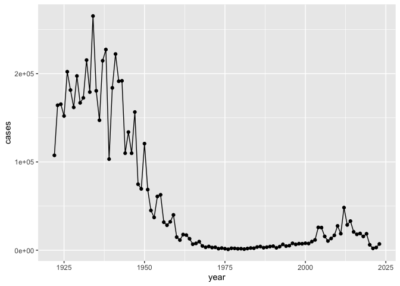
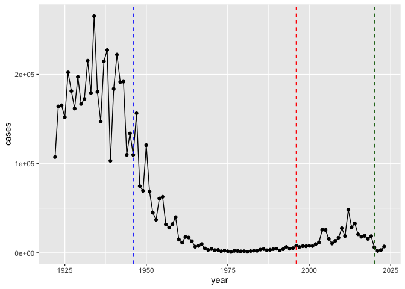
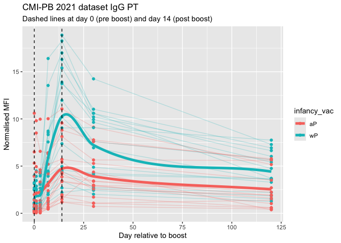
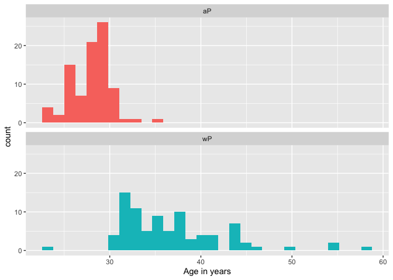
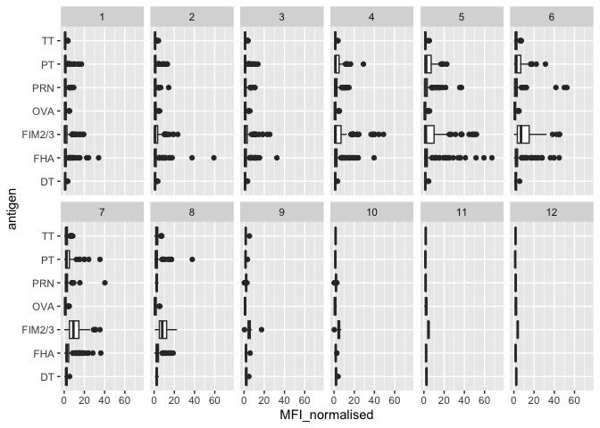
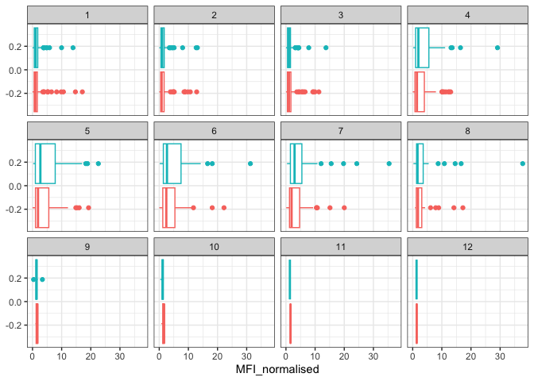

# Class 18: Pertussis Mini Project
Cyrus Shabahang (PID: 19145663)

- [Background](#background)
- [CMI-PB project](#cmi-pb-project)
- [Focus on “PT” Pertussis Toxin
  antigen](#focus-on-pt-pertussis-toxin-antigen)

## Background

Pertussis (a.k.a whooping cough) is a common lung infection caused by
the bacteria B. Pertussis.

This can infect all ages but is most severe for those under 1 year of
age.

The CDC track the number of [reported cases in the
US](https://www.cdc.gov/pertussis/php/surveillance/pertussis-cases-by-year.html)

We can “scrape” this data with the **datapasta** package.

> Q1. Make a plot of `year` vs `cases`

``` r
library(ggplot2)

ggplot(cdc) +
  aes(year, cases) +
  geom_point() +
  geom_line()
```



> Q2. Add some major milestones including the first wP vaccine rollout
> (1946), the switch to the newer aP vaccine (1996).

``` r
ggplot(cdc) +
  aes(year, cases) +
  geom_point() +
  geom_line() +
  geom_vline(xintercept = 1946, col = "blue", lty = 2) +
  geom_vline(xintercept = 1996, col = "red", lty = 2) +
  geom_vline(xintercept = 2020, col = "darkgreen", lty = 2) 
```



> Q3. Describe what happened after the introduction of the aP vaccine?
> Do you have a possible explanation for the observed trend?

There were high case numbers in the pre 1940s, then came the
introduction of the aP vaccine. This dramatically reduced the number of
cases. Differing from the wP vaccine, the aP vaccine needs a booster
vaccine after around 10 years. Around the 2000s we can see a rise in
cases, most likely due to people not getting booster vaccines. Around
2020, we can see cases drop due to quarantine for COVID-19, but rise
again likely due to anti-vaxxers from the fear of the COVID-19 vaccine.
The aP induced protection wanes faster than wP.

**Why is this vaccine-preventable disease on the upswing?** To answer
this question we need to investigate the mechanisms underlying waning
protection against pertussis. This requires evaluation of
pertussis-specific immune responses over time in wP and aP vaccinated
individuals.

## CMI-PB project

[Computational Models of Immunity](https://www.cmi-pb.org/) - Pertussis
Boost project aims to provide the scientific comunity with this very
information.

They make their data available via JSON format APIs. We can read this in
R with the `read_json()` function from the **jsonlite** package:

``` r
library(jsonlite)
library(ggplot2)
library(dplyr)
```


    Attaching package: 'dplyr'

    The following objects are masked from 'package:stats':

        filter, lag

    The following objects are masked from 'package:base':

        intersect, setdiff, setequal, union

``` r
library(lubridate)
```


    Attaching package: 'lubridate'

    The following objects are masked from 'package:base':

        date, intersect, setdiff, union

``` r
subject <- read_json("https://www.cmi-pb.org/api/subject", simplifyVector = TRUE)

specimen <- read_json("https://www.cmi-pb.org/api/v5_1/specimen",
                      simplifyVector = TRUE)

ab_titer <- read_json("https://www.cmi-pb.org/api/v5_1/plasma_ab_titer",
                      simplifyVector = TRUE)

meta <- inner_join(specimen, subject, by = "subject_id")
abdata <- inner_join(ab_titer, meta, by = "specimen_id")
```

> Q4. How many aP and wP infancy vaccinated subjects are in the dataset?

``` r
table(subject$infancy_vac)
```


    aP wP 
    87 85 

There are 87 aP and 85 wP infancy vaccinated subjects in this dataset.

> Q5. How many Male and Female subjects/patients are in the dataset?

``` r
table(subject$biological_sex)
```


    Female   Male 
       112     60 

There are 112 female and 60 male subjects/patients in this dataset.

> In terms of race and gender is this dataset representative of the US
> population?

> Q6. What is the breakdown of race and biological sex (e.g. number of
> Asian females, White males etc…)?

``` r
table(subject$race, subject$biological_sex)
```

                                               
                                                Female Male
      American Indian/Alaska Native                  0    1
      Asian                                         32   12
      Black or African American                      2    3
      More Than One Race                            15    4
      Native Hawaiian or Other Pacific Islander      1    1
      Unknown or Not Reported                       14    7
      White                                         48   32

``` r
head(specimen)
```

      specimen_id subject_id actual_day_relative_to_boost
    1           1          1                           -3
    2           2          1                            1
    3           3          1                            3
    4           4          1                            7
    5           5          1                           11
    6           6          1                           32
      planned_day_relative_to_boost specimen_type visit
    1                             0         Blood     1
    2                             1         Blood     2
    3                             3         Blood     3
    4                             7         Blood     4
    5                            14         Blood     5
    6                            30         Blood     6

``` r
head(ab_titer)
```

      specimen_id isotype is_antigen_specific antigen        MFI MFI_normalised
    1           1     IgE               FALSE   Total 1110.21154       2.493425
    2           1     IgE               FALSE   Total 2708.91616       2.493425
    3           1     IgG                TRUE      PT   68.56614       3.736992
    4           1     IgG                TRUE     PRN  332.12718       2.602350
    5           1     IgG                TRUE     FHA 1887.12263      34.050956
    6           1     IgE                TRUE     ACT    0.10000       1.000000
       unit lower_limit_of_detection
    1 UG/ML                 2.096133
    2 IU/ML                29.170000
    3 IU/ML                 0.530000
    4 IU/ML                 6.205949
    5 IU/ML                 4.679535
    6 IU/ML                 2.816431

``` r
library(lubridate)
```

What is today’s date (at the time I am writing this obviously)

``` r
today()
```

    [1] "2026-03-16"

How many days have passed since new year 2000

``` r
today() - ymd("2000-01-01")
```

    Time difference of 9571 days

What is this in years?

``` r
round(time_length(today() - ymd("2000-01-01"), "years"), 2)
```

    [1] 26.2

To analyze this data we need to first “join” the different tables so we
have all the data in one place, not spread across different tables.

We can use the `*_join()` family of functions from **dplyr** to do this.

``` r
library(dplyr)

meta <- inner_join(subject, specimen)
```

    Joining with `by = join_by(subject_id)`

``` r
head(meta)
```

      subject_id infancy_vac biological_sex              ethnicity  race
    1          1          wP         Female Not Hispanic or Latino White
    2          1          wP         Female Not Hispanic or Latino White
    3          1          wP         Female Not Hispanic or Latino White
    4          1          wP         Female Not Hispanic or Latino White
    5          1          wP         Female Not Hispanic or Latino White
    6          1          wP         Female Not Hispanic or Latino White
      year_of_birth date_of_boost      dataset specimen_id
    1    1986-01-01    2016-09-12 2020_dataset           1
    2    1986-01-01    2016-09-12 2020_dataset           2
    3    1986-01-01    2016-09-12 2020_dataset           3
    4    1986-01-01    2016-09-12 2020_dataset           4
    5    1986-01-01    2016-09-12 2020_dataset           5
    6    1986-01-01    2016-09-12 2020_dataset           6
      actual_day_relative_to_boost planned_day_relative_to_boost specimen_type
    1                           -3                             0         Blood
    2                            1                             1         Blood
    3                            3                             3         Blood
    4                            7                             7         Blood
    5                           11                            14         Blood
    6                           32                            30         Blood
      visit
    1     1
    2     2
    3     3
    4     4
    5     5
    6     6

``` r
abdata <- inner_join(ab_titer, meta)
```

    Joining with `by = join_by(specimen_id)`

``` r
head(abdata)
```

      specimen_id isotype is_antigen_specific antigen        MFI MFI_normalised
    1           1     IgE               FALSE   Total 1110.21154       2.493425
    2           1     IgE               FALSE   Total 2708.91616       2.493425
    3           1     IgG                TRUE      PT   68.56614       3.736992
    4           1     IgG                TRUE     PRN  332.12718       2.602350
    5           1     IgG                TRUE     FHA 1887.12263      34.050956
    6           1     IgE                TRUE     ACT    0.10000       1.000000
       unit lower_limit_of_detection subject_id infancy_vac biological_sex
    1 UG/ML                 2.096133          1          wP         Female
    2 IU/ML                29.170000          1          wP         Female
    3 IU/ML                 0.530000          1          wP         Female
    4 IU/ML                 6.205949          1          wP         Female
    5 IU/ML                 4.679535          1          wP         Female
    6 IU/ML                 2.816431          1          wP         Female
                   ethnicity  race year_of_birth date_of_boost      dataset
    1 Not Hispanic or Latino White    1986-01-01    2016-09-12 2020_dataset
    2 Not Hispanic or Latino White    1986-01-01    2016-09-12 2020_dataset
    3 Not Hispanic or Latino White    1986-01-01    2016-09-12 2020_dataset
    4 Not Hispanic or Latino White    1986-01-01    2016-09-12 2020_dataset
    5 Not Hispanic or Latino White    1986-01-01    2016-09-12 2020_dataset
    6 Not Hispanic or Latino White    1986-01-01    2016-09-12 2020_dataset
      actual_day_relative_to_boost planned_day_relative_to_boost specimen_type
    1                           -3                             0         Blood
    2                           -3                             0         Blood
    3                           -3                             0         Blood
    4                           -3                             0         Blood
    5                           -3                             0         Blood
    6                           -3                             0         Blood
      visit
    1     1
    2     1
    3     1
    4     1
    5     1
    6     1

> Q. What antibody isotypes are measured for these patients?

``` r
table(abdata$isotype)
```


      IgE   IgG  IgG1  IgG2  IgG3  IgG4 
     6698  7265 11993 12000 12000 12000 

> Q. What antigens are reported?

``` r
table(abdata$antigen)
```


        ACT   BETV1      DT   FELD1     FHA  FIM2/3   LOLP1     LOS Measles     OVA 
       1970    1970    6318    1970    6712    6318    1970    1970    1970    6318 
        PD1     PRN      PT     PTM   Total      TT 
       1970    6712    6712    1970     788    6318 

Let’s focus on the IgG isotype and make a plot of MFI_normalized for all
antigens.

``` r
igg <- abdata |> 
  filter(isotype == "IgG")

head(igg)
```

      specimen_id isotype is_antigen_specific antigen        MFI MFI_normalised
    1           1     IgG                TRUE      PT   68.56614       3.736992
    2           1     IgG                TRUE     PRN  332.12718       2.602350
    3           1     IgG                TRUE     FHA 1887.12263      34.050956
    4          19     IgG                TRUE      PT   20.11607       1.096366
    5          19     IgG                TRUE     PRN  976.67419       7.652635
    6          19     IgG                TRUE     FHA   60.76626       1.096457
       unit lower_limit_of_detection subject_id infancy_vac biological_sex
    1 IU/ML                 0.530000          1          wP         Female
    2 IU/ML                 6.205949          1          wP         Female
    3 IU/ML                 4.679535          1          wP         Female
    4 IU/ML                 0.530000          3          wP         Female
    5 IU/ML                 6.205949          3          wP         Female
    6 IU/ML                 4.679535          3          wP         Female
                   ethnicity  race year_of_birth date_of_boost      dataset
    1 Not Hispanic or Latino White    1986-01-01    2016-09-12 2020_dataset
    2 Not Hispanic or Latino White    1986-01-01    2016-09-12 2020_dataset
    3 Not Hispanic or Latino White    1986-01-01    2016-09-12 2020_dataset
    4                Unknown White    1983-01-01    2016-10-10 2020_dataset
    5                Unknown White    1983-01-01    2016-10-10 2020_dataset
    6                Unknown White    1983-01-01    2016-10-10 2020_dataset
      actual_day_relative_to_boost planned_day_relative_to_boost specimen_type
    1                           -3                             0         Blood
    2                           -3                             0         Blood
    3                           -3                             0         Blood
    4                           -3                             0         Blood
    5                           -3                             0         Blood
    6                           -3                             0         Blood
      visit
    1     1
    2     1
    3     1
    4     1
    5     1
    6     1

``` r
ggplot(igg) +
  aes(MFI_normalised, antigen) +
  geom_boxplot()
```


> Q. Is there a difference for aP vs wP individuals with these values?

``` r
ggplot(igg) +
  aes(MFI_normalised, antigen) +
  geom_boxplot() +
  facet_wrap(~infancy_vac)
```


``` r
ggplot(igg) +
  aes(MFI_normalised, antigen, col = infancy_vac) +
  geom_boxplot()
```


> Q. Is there a temporal reponse - i.e. do these values increase or
> decease over time?

``` r
ggplot(igg) +
  aes(MFI_normalised, antigen, col = infancy_vac) +
  geom_boxplot() +
  facet_wrap(~visit)
```


## Focus on “PT” Pertussis Toxin antigen

``` r
pt.igg.21 <- igg |> filter(antigen =="PT",
              dataset == "2021_dataset")
```

``` r
ggplot(pt.igg.21) +
  aes(planned_day_relative_to_boost, 
      MFI_normalised, 
      col = infancy_vac,
      group = subject_id) +
  geom_point() +
  geom_line() +
  geom_vline(xintercept = 14, lty =2)
```


``` r
pt.igg.21 <- igg |>
  filter(antigen == "PT", dataset == "2021_dataset")

pt.mean <- pt.igg.21 |>
  group_by(infancy_vac, planned_day_relative_to_boost) |>
  summarize(mean_MFI = mean(MFI_normalised, na.rm = TRUE), .groups = "drop")

pt.smooth <- pt.mean |>
  group_by(infancy_vac) |>
  group_modify(~{
    xgrid <- seq(min(.x$planned_day_relative_to_boost),
                 max(.x$planned_day_relative_to_boost),
                 length.out = 200)

    sf <- splinefun(.x$planned_day_relative_to_boost,
                    .x$mean_MFI,
                    method = "monoH.FC")

    data.frame(
      planned_day_relative_to_boost = xgrid,
      mean_MFI = sf(xgrid)
    )
  })

ggplot() +
  geom_point(data = pt.igg.21,
             aes(x = planned_day_relative_to_boost,
                 y = MFI_normalised,
                 col = infancy_vac)) +
  geom_line(data = pt.igg.21,
            aes(x = planned_day_relative_to_boost,
                y = MFI_normalised,
                col = infancy_vac,
                group = subject_id),
            alpha = 0.25) +
  geom_line(data = pt.smooth,
            aes(x = planned_day_relative_to_boost,
                y = mean_MFI,
                col = infancy_vac),
            linewidth = 1.8) +
  geom_vline(xintercept = 0, linetype = "dashed") +
  geom_vline(xintercept = 14, linetype = "dashed") +
  labs(title = "CMI-PB 2021 dataset IgG PT",
       subtitle = "Dashed lines at day 0 (pre boost) and day 14 (post boost)",
       x = "Day relative to boost",
       y = "Normalised MFI")
```



> Q7. Using this approach determine (i) the average age of wP
> individuals, (ii) the average age of aP individuals; and (iii) are
> they significantly different?

``` r
library(lubridate)
library(dplyr)

subject$age <- today() - ymd(subject$year_of_birth)

ap <- subject %>% filter(infancy_vac == "aP")
wp <- subject %>% filter(infancy_vac == "wP")

mean_ap <- mean(time_length(ap$age, "years"))
mean_wp <- mean(time_length(wp$age, "years"))

mean_ap
```

    [1] 28.09932

``` r
mean_wp
```

    [1] 36.85002

``` r
t.test(time_length(wp$age, "years"),
       time_length(ap$age, "years"))
```


        Welch Two Sample t-test

    data:  time_length(wp$age, "years") and time_length(ap$age, "years")
    t = 12.918, df = 104.03, p-value < 2.2e-16
    alternative hypothesis: true difference in means is not equal to 0
    95 percent confidence interval:
      7.407351 10.094058
    sample estimates:
    mean of x mean of y 
     36.85002  28.09932 

The wP group on average is older than the aP group. From this Welch Two
Sample t-test the age difference betwen the two groups is definitey
significant.

> Q8. Determine the age of all individuals at time of boost?

``` r
subject$age_at_boost <- time_length(
  ymd(subject$date_of_boost) - ymd(subject$year_of_birth),
  "years"
)

head(subject$age_at_boost)
```

    [1] 30.69678 51.07461 33.77413 28.65982 25.65914 28.77481

``` r
summary(subject$age_at_boost)
```

       Min. 1st Qu.  Median    Mean 3rd Qu.    Max. 
      18.83   21.03   25.75   26.09   29.56   51.07 

In this table, we can view the age of all individuals at the time of the
booster vaccine.

> Q9. With the help of a faceted boxplot or histogram (see below), do
> you think these two groups are significantly different?

``` r
ggplot(subject) +
  aes(time_length(age, "year"),
      fill = as.factor(infancy_vac)) +
  geom_histogram(show.legend = FALSE) +
  facet_wrap(vars(infancy_vac), nrow = 2) +
  xlab("Age in years")
```

    `stat_bin()` using `bins = 30`. Pick better value `binwidth`.



Yes, these two age groups are significantly different. We can see that
the wP group is shifted older the aP group. This is as expected due to
the vaccine switch.

> Q10. Now using the same procedure join meta with titer data so we can
> further analyze this data in terms of time of visit aP/wP, male/female
> etc.

``` r
head(meta)
```

      subject_id infancy_vac biological_sex              ethnicity  race
    1          1          wP         Female Not Hispanic or Latino White
    2          1          wP         Female Not Hispanic or Latino White
    3          1          wP         Female Not Hispanic or Latino White
    4          1          wP         Female Not Hispanic or Latino White
    5          1          wP         Female Not Hispanic or Latino White
    6          1          wP         Female Not Hispanic or Latino White
      year_of_birth date_of_boost      dataset specimen_id
    1    1986-01-01    2016-09-12 2020_dataset           1
    2    1986-01-01    2016-09-12 2020_dataset           2
    3    1986-01-01    2016-09-12 2020_dataset           3
    4    1986-01-01    2016-09-12 2020_dataset           4
    5    1986-01-01    2016-09-12 2020_dataset           5
    6    1986-01-01    2016-09-12 2020_dataset           6
      actual_day_relative_to_boost planned_day_relative_to_boost specimen_type
    1                           -3                             0         Blood
    2                            1                             1         Blood
    3                            3                             3         Blood
    4                            7                             7         Blood
    5                           11                            14         Blood
    6                           32                            30         Blood
      visit
    1     1
    2     2
    3     3
    4     4
    5     5
    6     6

``` r
head(abdata)
```

      specimen_id isotype is_antigen_specific antigen        MFI MFI_normalised
    1           1     IgE               FALSE   Total 1110.21154       2.493425
    2           1     IgE               FALSE   Total 2708.91616       2.493425
    3           1     IgG                TRUE      PT   68.56614       3.736992
    4           1     IgG                TRUE     PRN  332.12718       2.602350
    5           1     IgG                TRUE     FHA 1887.12263      34.050956
    6           1     IgE                TRUE     ACT    0.10000       1.000000
       unit lower_limit_of_detection subject_id infancy_vac biological_sex
    1 UG/ML                 2.096133          1          wP         Female
    2 IU/ML                29.170000          1          wP         Female
    3 IU/ML                 0.530000          1          wP         Female
    4 IU/ML                 6.205949          1          wP         Female
    5 IU/ML                 4.679535          1          wP         Female
    6 IU/ML                 2.816431          1          wP         Female
                   ethnicity  race year_of_birth date_of_boost      dataset
    1 Not Hispanic or Latino White    1986-01-01    2016-09-12 2020_dataset
    2 Not Hispanic or Latino White    1986-01-01    2016-09-12 2020_dataset
    3 Not Hispanic or Latino White    1986-01-01    2016-09-12 2020_dataset
    4 Not Hispanic or Latino White    1986-01-01    2016-09-12 2020_dataset
    5 Not Hispanic or Latino White    1986-01-01    2016-09-12 2020_dataset
    6 Not Hispanic or Latino White    1986-01-01    2016-09-12 2020_dataset
      actual_day_relative_to_boost planned_day_relative_to_boost specimen_type
    1                           -3                             0         Blood
    2                           -3                             0         Blood
    3                           -3                             0         Blood
    4                           -3                             0         Blood
    5                           -3                             0         Blood
    6                           -3                             0         Blood
      visit
    1     1
    2     1
    3     1
    4     1
    5     1
    6     1

> Q11. How many specimens (i.e. entries in abdata) do we have for each
> isotype?

``` r
table(abdata$isotype)
```


      IgE   IgG  IgG1  IgG2  IgG3  IgG4 
     6698  7265 11993 12000 12000 12000 

> Q12. What are the different \$dataset values in abdata and what do you
> notice about the number of rows for the most “recent” dataset?

``` r
table(abdata$dataset)
```


    2020_dataset 2021_dataset 2022_dataset 2023_dataset 
           31520         8085         7301        15050 

This dataset column contains many study datasets, which include the
2020_dataset and 2021_dataset. I noticed that the most recent dataset
has less rows than the older ones, which could indicate fewer
measurements or subjects.

``` r
igg <- abdata %>% filter(isotype == "IgG")
head(igg)
```

      specimen_id isotype is_antigen_specific antigen        MFI MFI_normalised
    1           1     IgG                TRUE      PT   68.56614       3.736992
    2           1     IgG                TRUE     PRN  332.12718       2.602350
    3           1     IgG                TRUE     FHA 1887.12263      34.050956
    4          19     IgG                TRUE      PT   20.11607       1.096366
    5          19     IgG                TRUE     PRN  976.67419       7.652635
    6          19     IgG                TRUE     FHA   60.76626       1.096457
       unit lower_limit_of_detection subject_id infancy_vac biological_sex
    1 IU/ML                 0.530000          1          wP         Female
    2 IU/ML                 6.205949          1          wP         Female
    3 IU/ML                 4.679535          1          wP         Female
    4 IU/ML                 0.530000          3          wP         Female
    5 IU/ML                 6.205949          3          wP         Female
    6 IU/ML                 4.679535          3          wP         Female
                   ethnicity  race year_of_birth date_of_boost      dataset
    1 Not Hispanic or Latino White    1986-01-01    2016-09-12 2020_dataset
    2 Not Hispanic or Latino White    1986-01-01    2016-09-12 2020_dataset
    3 Not Hispanic or Latino White    1986-01-01    2016-09-12 2020_dataset
    4                Unknown White    1983-01-01    2016-10-10 2020_dataset
    5                Unknown White    1983-01-01    2016-10-10 2020_dataset
    6                Unknown White    1983-01-01    2016-10-10 2020_dataset
      actual_day_relative_to_boost planned_day_relative_to_boost specimen_type
    1                           -3                             0         Blood
    2                           -3                             0         Blood
    3                           -3                             0         Blood
    4                           -3                             0         Blood
    5                           -3                             0         Blood
    6                           -3                             0         Blood
      visit
    1     1
    2     1
    3     1
    4     1
    5     1
    6     1

> Q13. Complete the following code to make a summary boxplot of Ab titer
> levels (MFI) for all antigens:

``` r
ggplot(igg) +
  aes(MFI_normalised, antigen) +
  geom_boxplot() +
  xlim(0, 75) +
  facet_wrap(vars(visit), nrow = 2)
```

    Warning: Removed 5 rows containing non-finite outside the scale range
    (`stat_boxplot()`).



> Q14. What antigens show differences in the level of IgG antibody
> titers recognizing them over time? Why these and not others?

The antigens that show the differences are PT, PRN, FHA, and FIM2/3.
These antigens appear to rise after a booster and then fall again. A
control antigen like the OVA is one that appears to stay low over time
since it is not part of the vaccine response.

> Q15. Filter to pull out only two specific antigens for analysis and
> create a boxplot for each. You can chose any you like. Below I picked
> a “control” antigen (“OVA”, that is not in our vaccines) and a clear
> antigen of interest (“PT”, Pertussis Toxin, one of the key virulence
> factors produced by the bacterium B. pertussis).

``` r
filter(igg, antigen == "OVA") %>%
  ggplot() +
  aes(MFI_normalised, col = infancy_vac) +
  geom_boxplot(show.legend = FALSE) +
  facet_wrap(vars(visit)) +
  theme_bw()
```


``` r
filter(igg, antigen == "PT") %>%
  ggplot() +
  aes(MFI_normalised, col = infancy_vac) +
  geom_boxplot(show.legend = FALSE) +
  facet_wrap(vars(visit)) +
  theme_bw()
```



> Q16. What do you notice about these two antigens time courses and the
> PT data in particular?

I noticed that the OVA antigen acts like a negative control and seems to
stay relatively low over time with low evidence of a strong booster
response. The PT antigen shows more evidence of a rise after the booster
and peaks around the middle visits, then declines afterwards. PT seems
to be the one with the expected antigen-specific immunse reponse.

> Q17. Do you see any clear difference in aP vs. wP responses?

There seems to be some differences between aP and wP responses. The wP
response is higher for pertussus related responses but there is also
some overlap between the groups.

``` r
abdata.21 <- abdata %>% filter(dataset == "2021_dataset")

abdata.21 %>% 
  filter(isotype == "IgG",  antigen == "PT") %>%
  ggplot() +
    aes(x=planned_day_relative_to_boost,
        y=MFI_normalised,
        col=infancy_vac,
        group=subject_id) +
    geom_point() +
    geom_line() +
    geom_vline(xintercept=0, linetype="dashed") +
    geom_vline(xintercept=14, linetype="dashed") +
  labs(title="2021 dataset IgG PT",
       subtitle = "Dashed lines indicate day 0 (pre-boost) and 14 (apparent peak levels)")
```


> Q18. Does this trend look similar for the 2020 dataset?

Yes, this trend looks similar for the 2020 dataset. We can see that
antibody levels rise after the boost and peak around the earlier/middle
boost period and then begin to decline.

``` r
rna_url <- "https://www.cmi-pb.org/api/v2/rnaseq?versioned_ensembl_gene_id=eq.ENSG00000211896.7"

if (!file.exists("IGHG1_rna.json")) {
  download.file(rna_url, destfile = "IGHG1_rna.json", mode = "wb")
}

rna <- read_json("IGHG1_rna.json", simplifyVector = TRUE)
ssrna <- inner_join(rna, meta, by = "specimen_id")
```

> Q19. Make a plot of the time course of gene expression for IGHG1 gene
> (i.e. a plot of visit vs. tpm).

``` r
ggplot(ssrna) +
  aes(visit, tpm, group = subject_id) +
  geom_point() +
  geom_line(alpha = 0.2)
```


> Q20.: What do you notice about the expression of this gene (i.e. when
> is it at it’s maximum level)?

This IGHG1 gene expression seems to be highest around the time the
booster is administered and around the early post-boost visits instead
of later visits.

> 21. Does this pattern in time match the trend of antibody titer data?
>     If not, why not?

This pattern doesn’t fully match the trend of antibody titer data
because the gene expression changes occur earlier than antibody titer
changes. Titer peaks later and stays elevated for a longer period of
time.

We can dig deeper and color and/or facet by infancy_vac status:

``` r
ggplot(ssrna) +
  aes(tpm, col=infancy_vac) +
  geom_boxplot() +
  facet_wrap(vars(visit))
```


There is however no obvious wP vs. aP differences here even if we focus
in on a particular visit:

``` r
ssrna %>%  
  filter(visit==4) %>% 
  ggplot() +
    aes(tpm, col=infancy_vac) + geom_density() + 
    geom_rug() 
```


